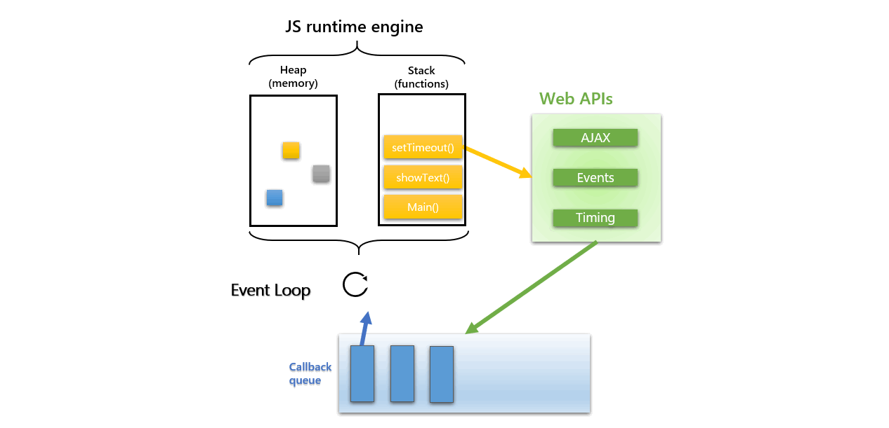

# JavaScript执行机制深度解析系列文章

## 最佳食用方式导言

本系列文章适用人群：工作1~3年有一定JavaScript开发基础的同学。

相信很多从事过一段时间前端开发的同学对于此图并不陌生，本系列文章就从本图开始，将JavaScript运行中出现的各种概念逐一分析清楚，最终也将回归于本土。

## 系列文章的大纲：

1. 从宏观到微观，对于event loop模型进行解读。
2. 宏观上，我将开门见山的讲解JavaScript执行机制中的event loop，通过event loop模型了解JavaScript的整体运行流程，如何处理异步。主要内容有JavaScript单线程，web APIs，任务队列（task queue）。
3. 在此之后我将对event loop模型图进行拆解，对于各部分进行深入的研究。重点拆解JavaScript runtime engine部分，在此之前，我将先讲解JavaScript的内存分配，重点讲明堆栈结构。
4. 在内存分配之后，我们要对调用栈进行更加深入的解析，这时候就要接触到一个重要概念：执行上下文。讲解调用栈和执行上下文的关系。
5. 微观上，我们对于执行上下文进行进一步拆解，这时候就可以得到三部分：变量对象、作用域链和this绑定，然后进行进一步的研究。
6. 在对变量对象研究时，有个特殊的情况，我们要按照不同的ECMAscript标准对于执行上下文内部进行研究。因为按照ES3.x的规范，我们常挂在嘴边的是执行上下文内部实现是变量对象。而在ES5.x规范中，我们对于执行上下文的内部实现是词法环境。

1. 了解JavaScript的内存管理，这是运行机制解析的铺垫工作
2. 在了解JavaScript的内存管理中，认识（Stack）和（Heap）
3. 分析Stack、Heap与Call Stack之间的关系和联系
4. 正式进入JavaScript执行机制的分析，主要是调用栈、异步队列和事件循环等概念解析。
5. JavaScript执行上下文分析基础文：分析VO、AO、GO和词法环境、变量环境的区别
6. JavaScriptES3中VO、AO、GO详解执行过程
7. JavaScript与ES5中词法环境详解过程
8. 实战，执行上下文的实例应用举例：闭包