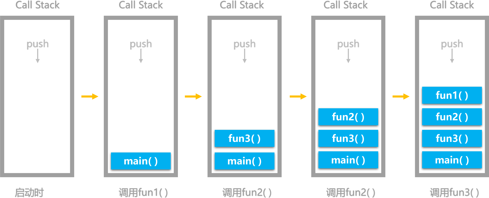

# 调用栈、异步队列和事件循环等概念解析

学习和使用JavaScript这门语言眼看着也有了两年时光，一直以来对于JavaScript的运行机制不甚了解，  
一方面是自己对于语言底层的东西很感兴趣，另一方面，这些知识也给开发带来更多的助力（虽然表面上看上去没怎么用到。）

这篇文章主要阐述执行上下文、调用栈、异步队列、实践循环之间的关系

## 关键词
* Call Stack：调用栈
* Event Table：事件表
* Event Queue：异步事件队列
* Event Loop：事件循环
* Callback Queue: 回调队列

## 一切从执行栈开始

关于执行栈，这其实并不是JavaScript专有的知识 ，计算机语言的执行几乎都是依赖于执行栈的。

> 执行栈是计算机科学中存储有关正在运行的子程序的消息的栈。经常被用于存放子程序的返回地址。在调用任何子程序时，主程序都必须暂存子程序运行完毕后应该返回到的地址。因此，如果被调用的子程序还要调用其他的子程序，其自身的返回地址就必须存入执行栈，在其自身运行完毕后再行取回。在递归程序中，每一层次递归都必须在执行栈上增加一条地址，因此如果程序出现无限递归（或仅仅是过多的递归层次），执行栈就会产生栈溢出。

关于执行栈的称呼或者说别名有很多种：
* 执行栈（Execution stack）
* 调用栈（Call stack）
* 控制栈（Control stack）
* 运行时栈（Run-time stack）
* 机器栈（Machine stack）

以上名词所要表达的都是一个意思，下文中指定使用 **执行栈** 表达

下面是段代码示例
```js
function func1() {
  console.log('in function1');
}

function func2() {
  func1();
  console.log('in function2');
}

function func3() {
  func2();
  console.log('in function3');
}

func3();
```



### **功能**

调用栈的主要功能是存放返回地址。除此之外，调用栈还用于存放：
* 本地变量：子程序的变量可以存入调用栈，这样可以达到不同子程序间变量分离开的作用。
* 参数传递：如果寄存器不足以容纳子程序的参数，可以在调用栈上存入参数。
* 环境传递：有些语言（如Pascal与Ada）支持“多层子程序”，即子程序中可以利用主程序的本地变量。这些变量可以通过调用栈传入子程序。

## 调用栈和Event Loop

JavaScript执行栈示意图（图-2）  


如果你暂时看不懂这个图，没有关系，让我们先学习铺垫知识。

### 关于JavaScript单线程这件事情

首先要提的是：JavaScript这一门单线程的语言（不像java对于线程的操作）。

有必要解释一下JavaScript设计之初为什么是单线程语言。举个简单的例子，假定JavaScript同时有两个线程，一个线程在某个DOM节点上添加内容，另一个线程删除了这个节点，这时浏览器应该以哪个线程为准？ 所以，为了避免复杂性，从一诞生，JavaScript就是单线程，这已经成了这门语言的核心特征 。

避免了多线程中复杂的状态同步，写程序时不用考虑并发访问。

这里又引出两个概念，同步(Synchronous)和异步(Asynchronous)。

由于上面例子中不可抗拒的原因，我们必须把JavaScript需要完成的事情分成同步和异步。

> JS引擎中负责解释和执行JavaScript代码的线程只有一个，就叫做主线程，实际上还有其它的线程，例如处理AJAX请求的线程、处理DOM事件的线程、定时器线程等等，他们叫做工作线程。

JS引擎中负责解释和执行JavaScript代码的线程只有一个，叫做主线程，主线程会被分配一个stack，这就是**同步执行栈**，也叫做调用栈（call stack），同时JS引擎还会维护一个异步队列，用于维护异步事件，这就是**异步队列**（event queue）。在JavaScript存在一些web apis，这些api天生就是异步的。例如：。。。。。。。

需要说明的是，JS引擎虽然只有一个主线程，但实际上还有其他进程处理类似ajax、dom event、定时器等事件。

JavaScript中异步API此图展示！！！

现在回过头在看（图-2），我们就能看懂JavaScript运行机制大概是怎么回事。

但其实，问题远没有这么简单：（图-2）中实际对于Event Loop的解释我是不满意的，因为并没有对于循环有着充分理解。


```js
/* Within main.js */
var firstFunction = function () {  
  console.log("I'm first!");
};
var secondFunction = function () {  
  firstFunction();
  console.log("I'm second!");
};
secondFunction();
/* Results:
 * => I'm first!
 * => I'm second!
 */
```
macrotask任务队列的来源有：
* setTimeout
* setInterval
* setImmediate
* I/O
* UI rendering

microtask任务队列的来源有：
* process.nextTick
* promises
* Object.observe
* MutationObserver

参考资料
* [JavaScript 异步、栈、事件循环、任务队列][1]
* [javaScript异步、消息队列、事件循环][2]
* [JavaScript 事件循环（译文JavaScript Event Loop）][3]
* [JavaScript 运行机制详解：再谈Event Loop][4]
* [js运行机制详解（Event Loop）][5]
* [Event Loops, Event Tables & Event Queues in JavaScript][6]
* [Understanding JS: The Event Loop][7]
* [What is the JavaScript event loop?][8]
* [浏览器与NodeJS的EventLoop异同，以及部分机制。][9]
* [不要混淆nodejs和浏览器中的event loop][10]
* [从浏览器多进程到JS单线程，JS运行机制最全面的一次梳理][11]
* [深入理解Javascript之Callstack&EventLoop][12]
* [027 - 进阶函数-06 call stack 调用栈][13]
* [JavaScript中线程运行机制详解][14]

[1]: https://segmentfault.com/a/1190000011198232
[2]: https://blog.csdn.net/lq15310444798/article/details/80369086
[3]: https://segmentfault.com/a/1190000006811224
[4]: http://www.ruanyifeng.com/blog/2014/10/event-loop.html
[5]: https://www.jianshu.com/p/e06e86ef2595
[6]: https://knowledgescoops.com/javascript/event-loops-event-tables-event-queues-in-javascript/
[7]: https://hackernoon.com/understanding-js-the-event-loop-959beae3ac40
[8]: http://altitudelabs.com/blog/what-is-the-javascript-event-loop/
[9]: https://segmentfault.com/a/1190000015552098
[10]: https://cnodejs.org/topic/5a9108d78d6e16e56bb80882
[11]: https://www.cnblogs.com/cangqinglang/p/8963557.html
[12]: https://www.jianshu.com/p/735ee3d12a43
[13]: https://blog.csdn.net/weixin_34111819/article/details/87147031
[14]: https://segmentfault.com/a/1190000010345930