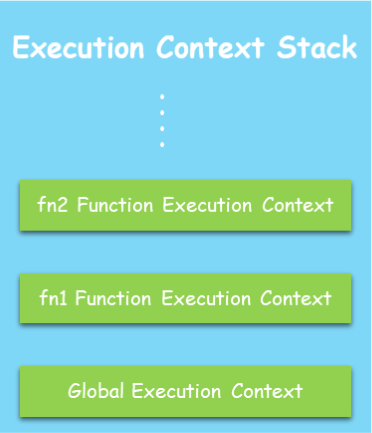

# JavaScript执行机制深度解析——执行上下文与调用栈


相信这张图大家一定不会陌生，之前关于执行栈和event loop的讲解就和大家见过面，但是这种图中仍然有未解之谜。 对于大括号里面的的部分相信大家非常好奇，其实这是JavaScript代码执行最关键的部分。

这里面首先是内存分配的问题，然后是调用栈中到底发生了什么！



## 什么是执行上下文

简而言之，执行上下文就是当前 **JavaScript 代码被解析和执行时所在环境**的抽象概念， JavaScript 中运行任何的代码都是在执行上下文中运行。

执行上下文的类型
执行上下文总共有三种类型：

* **全局执行上下文**： 这是默认的、最基础的执行上下文。不在任何函数中的代码都位于全局执行上下文中。它做了两件事：1. 创建一个全局对象，在浏览器中这个全局对象就是 window 对象。2. 将 `this` 指针指向这个全局对象。一个程序中只能存在一个全局执行上下文。
* **函数执行上下文**： 每次调用函数时，都会为该函数创建一个新的执行上下文。每个函数都拥有自己的执行上下文，但是只有在函数被调用的时候才会被创建。一个程序中可以存在任意数量的函数执行上下文。每当一个新的执行上下文被创建，它都会按照特定的顺序执行一系列步骤，具体过程将在本文后面讨论。
* **Eval 函数执行上下文**： 运行在 `eval` 函数中的代码也获得了自己的执行上下文，但由于 Javascript 开发人员不常用 `eval` 函数，所以在这里不再讨论。

javascript是一个单线程语言，这意味着在浏览器中同时只能做一件事情。当javascript解释器初始执行代码，它首先默认进入全局上下文。每次调用一个函数将会创建一个新的执行上下文。 


每次新创建的一个执行上下文会被添加到作用域链的顶部，有时也称为执行或调用栈。浏览器总是运行位于作用域链顶部的当前执行上下文。一旦完成，当前执行上下文将从栈顶被移除并且将控制权归还给之前的执行上下文。

不同执行上下文之间的变量命名冲突通过攀爬作用域链解决，从局部直到全局。这意味着具有相同名称的局部变量在作用域链中有更高的优先级。 
简单的说，每次你试图访问函数执行上下文中的变量时，查找进程总是从自己的变量对象开始。如果在自己的变量对象中没发现要查找的变量，继续搜索作用域链。它将攀爬作用域链检查每一个执行上下文的变量对象，寻找和变量名称匹配的值。

程序运行时，每个线程分配一个stack，每个进程分配一个heap，也就是说，stack是线程独占的，heap是线程共用的。此外，stack创建的时候，大小是确定的，数据超过这个大小，就发生stack overflow错误，而heap的大小是不确定的，需要的话可以不断增加。所以这里只看stack的大小限制。下面是一个简单的测试

我们现在已经知道，每当调用一个函数时，一个新的执行上下文就会被创建出来。然而，在javascript引擎内部，这个上下文的创建过程具体分为两个阶段:

建立阶段(发生在当调用一个函数时，但是在执行函数体内的具体代码以前)
建立变量，函数，arguments对象，参数
建立作用域链
确定this的值
代码执行阶段:
变量赋值，函数引用，执行其它代码

定义
每次当控制器转到ECMAScript可执行代码的时候，即会进入到一个执行上下文。执行上下文(简称-EC)是ECMA-262标准里的一个抽象概念，用于同可执行代码(executable code)概念进行区分。
标准规范没有从技术实现的角度定义EC的准确类型和结构，这应该是具体实现ECMAScript引擎时要考虑的问题。
活动的执行上下文组在逻辑上组成一个堆栈。堆栈底部永远都是全局上下文(global context)，而顶部就是当前(活动的)执行上下文。堆栈在EC类型进入和退出上下文的时候被修改（推入或弹出）。
可执行代码类型
可执行代码的类型这个概念与执行上下文的抽象概念是有关系的。在某些时刻，可执行代码与执行上下文完全有可能是等价的。
例如，我们可以定义执行上下文堆栈是一个数组：
```js
ECStack = [];
```

每次进入function (即使function被递归调用或作为构造函数) 的时候或者内置的eval函数工作的时候，这个堆栈都会被压入。
全局代码
这种类型的代码是在"程序"级处理的：例如加载外部的js文件或者本地<script></script>标签内的代码。全局代码不包括任何function体内的代码。
在初始化（程序启动）阶段，ECStack是这样的：

```js
ECStack = [
  globalContext
];
```

函数代码
当进入funtion函数代码(所有类型的funtions)的时候，ECStack被压入新元素。需要注意的是，具体的函数代码不包括内部函数(inner functions)代码。如下所示，我们使函数自己调自己的方式递归一次：

```js
(function  foo(bar) {
  if (bar) {
    return;
  }
  foo(true);
})();
```

那么，ECStack以如下方式被改变：

```js
// 第一次foo的激活调用
ECStack = [
  <foo> functionContext
  globalContext
];
// foo的递归激活调用
ECStack = [
  <foo> functionContext – recursively
  <foo> functionContext
  globalContext
];
```

每次return的时候，都会退出当前执行上下文的，相应地ECStack就会弹出，栈指针会自动移动位置，这是一个典型的堆栈实现方式。一个抛出的异常如果没被截获的话也有可能从一个或多个执行上下文退出。相关代码执行完以后，ECStack只会包含全局上下文(global context)，一直到整个应用程序结束。
Eval 代码
eval 代码有点儿意思。它有一个概念： 调用上下文(calling context),例如，eval函数调用的时候产生的上下文。eval(变量或函数声明)活动会影响调用上下文(calling context)。

```js
eval('var x = 10');
(function foo() {
  eval('var y = 20');
})();
alert(x); // 10
alert(y); // "y" 提示没有声明
ECStack的变化过程：
ECStack = [
  globalContext
];
// eval('var x = 10');
ECStack.push(
  evalContext,
  callingContext: globalContext
);
// eval exited context
ECStack.pop();
// foo funciton call
ECStack.push(<foo> functionContext);
// eval('var y = 20');
ECStack.push(
  evalContext,
  callingContext: <foo> functionContext
);
// return from eval
ECStack.pop();
// return from foo
ECStack.pop();
```

也就是一个非常普通的逻辑调用堆栈。
在版本号1.7以上的SpiderMonkey(内置于Firefox,Thunderbird)的实现中，可以把调用上下文作为第二个参数传递给eval。那么，如果这个上下文存在，就有可能影响“私有”(有人喜欢这样叫它)变量。

```js
function foo() {
  var x = 1;
  return function () { alert(x); };
};
 
var bar = foo();
 
bar(); // 1
 
eval('x = 2', bar); // 传入上下文，影响了内部的var x 变量
 
bar(); // 2
```