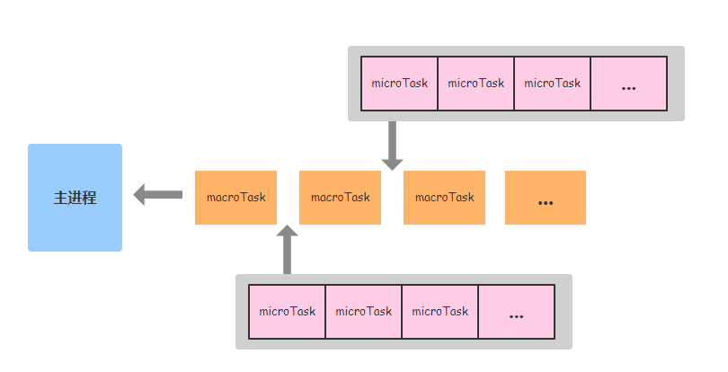
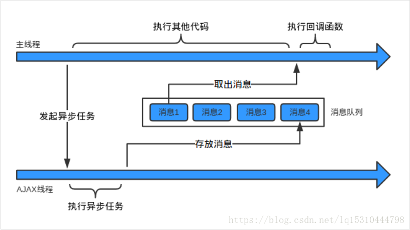

# JavaScript执行机制深度解析——浏览器和NodeJs中Event Loop区别

Event loop在browser端和node端也有区分。浏览器的 Event Loop 遵循的是 HTML5 标准，而 NodeJs 的 Event Loop 遵循的是 libuv。

## 浏览器的 Event Loop

在JavaScript中，任务被分为Task（又称为MacroTask,宏任务）和MicroTask（微任务）两种。它们分别包含以下内容：

**macrotask**任务队列的来源有：
# | 浏览器 | Node 
- | :-: | :-: 
I/O | ✅ | ✅
setTimeout | ✅| ✅
setInterval | ✅| ✅
setImmediate | ❌| ✅
UI rendering | ✅| ❌
requestAnimationFrame | ✅| ❌


**microtask**任务队列的来源有：
# | 浏览器 | Node 
- | :-: | :-: 
process.nextTick | ❌| ✅
MutationObserver | ✅| ❌
Promise.then catch finally | ✅| ✅

需要注意的一点是：在同一个上下文中，总的执行顺序为同步代码—>microTask—>macroTask。这一块我们在下文中会讲。

浏览器中，一个事件循环里有很多个来自不同任务源的任务队列（task queues），每一个任务队列里的任务是严格按照先进先出的顺序执行的。但是，因为浏览器自己调度的关系，不同任务队列的任务的执行顺序是不确定的。

具体来说，浏览器会不断从task队列中按顺序取task执行，每执行完一个task都会检查microtask队列是否为空（执行完一个task的具体标志是函数执行栈为空），如果不为空则会一次性执行完所有microtask。然后再进入下一个循环去task队列中取下一个task执行，以此类推。

一个事件循环有一个或者多个任务队列（task queues）。任务队列是task的有序列表，这些task是以下工作的对应算法：Events，Parsing，Callbacks，Using a resource，Reacting to DOM manipulation。
每一个任务都来自一个特定的任务源（task source）。所有来自一个特定任务源并且属于特定事件循环的任务，通常必须被加入到同一个任务队列中，但是来自不同任务源的任务可能会放在不同的任务队列中。

举个例子，用户代理有一个处理鼠标和键盘事件的任务队列。用户代理可以给这个队列比其他队列多3/4的执行时间，以确保交互的响应而不让其他任务队列饿死（starving），并且不会乱序处理任何一个任务队列的事件。

每个事件循环都有一个进入microtask检查点（performing a microtask checkpoint）的flag标志，这个标志初始为false。它被用来组织反复调用‘进入microtask检查点’的算法。


我们上面讲到，当stack空的时候，主进程就会从任务队列中，取任务来执行。浏览器这边，共分3步：

1. 取一个宏任务来执行。执行完毕后，下一步。
2. 取一个微任务来执行，执行完毕后，再取一个微任务来执行。直到微任务队列为空，执行下一步。
3. 更新UI渲染。

Event Loop 会无限循环执行上面3步，这就是Event Loop的主要控制逻辑。其中，第3步（更新UI渲染）会根据浏览器的逻辑，决定要不要马上执行更新。毕竟更新UI成本大，所以，一般都会比较长的时间间隔，执行一次更新。

从执行步骤来看，我们发现微任务，受到了特殊待遇！我们代码开始执行都是从script（全局任务）开始，所以，一旦我们的全局任务（属于宏任务）执行完，就马上执行完整个微任务队列。看个例子：


#### NodeJs 的 Event Loop





NodeJs 的运行是这样的：

1. 初始化 Event Loop
2. 执行您的主代码。这里同样，遇到异步处理，就会分配给对应的队列。直到主代码执行完毕。
3. 执行主代码中出现的所有微任务：先执行完所有nextTick()，然后在执行其它所有微任务。
4. 开始 Event Loop

NodeJs 的 Event Loop 分6个阶段执行：

```
   ┌───────────────────────────┐
┌─>│           timers          │
│  └─────────────┬─────────────┘
│  ┌─────────────┴─────────────┐
│  │     pending callbacks     │
│  └─────────────┬─────────────┘
│  ┌─────────────┴─────────────┐
│  │       idle, prepare       │
│  └─────────────┬─────────────┘      ┌───────────────┐
│  ┌─────────────┴─────────────┐      │   incoming:   │
│  │           poll            │<─────┤  connections, │
│  └─────────────┬─────────────┘      │   data, etc.  │
│  ┌─────────────┴─────────────┐      └───────────────┘
│  │           check           │
│  └─────────────┬─────────────┘
│  ┌─────────────┴─────────────┐
└──┤      close callbacks      │
   └───────────────────────────┘
```

```
   ┌───────────────────────┐
┌─>│        timers         │<————— 执行 setTimeout()、setInterval() 的回调
│  └──────────┬────────────┘
|             |<-- 执行所有 Next Tick Queue 以及 MicroTask Queue 的回调
│  ┌──────────┴────────────┐
│  │     pending callbacks │<————— 执行由上一个 Tick 延迟下来的 I/O 回调（待完善，可忽略）
│  └──────────┬────────────┘
|             |<-- 执行所有 Next Tick Queue 以及 MicroTask Queue 的回调
│  ┌──────────┴────────────┐
│  │     idle, prepare     │<————— 内部调用（可忽略）
│  └──────────┬────────────┘     
|             |<-- 执行所有 Next Tick Queue 以及 MicroTask Queue 的回调
|             |                   ┌───────────────┐
│  ┌──────────┴────────────┐      │   incoming:   │ - (执行几乎所有的回调，除了 close callbacks 以及 timers 调度的回调和 setImmediate() 调度的回调，在恰当的时机将会阻塞在此阶段)
│  │         poll          │<─────┤  connections, │ 
│  └──────────┬────────────┘      │   data, etc.  │ 
│             |                   |               | 
|             |                   └───────────────┘
|             |<-- 执行所有 Next Tick Queue 以及 MicroTask Queue 的回调
|  ┌──────────┴────────────┐      
│  │        check          │<————— setImmediate() 的回调将会在这个阶段执行
│  └──────────┬────────────┘
|             |<-- 执行所有 Next Tick Queue 以及 MicroTask Queue 的回调
│  ┌──────────┴────────────┐
└──┤    close callbacks    │<————— socket.on('close', ...)
   └───────────────────────┘
```

1. timers: 这个阶段执行setTimeout()和setInterval()设定的回调。
3. pending callbacks: 上一轮循环中有少数的 I/O callback 会被延迟到这一轮的这一阶段执行。
4. idle, prepare: 仅内部使用。
5. poll: 执行 I/O callback，在适当的条件下会阻塞在这个阶段
6. check: 执行setImmediate()设定的回调。
7. close callbacks: 执行比如socket.on('close', ...)的回调。

每个阶段执行完毕后，都会执行所有微任务（先 nextTick，后其它），然后再进入下一个阶段。

### Event loop 模型的优化
现在回过头在看（图-2），我们就能看懂JavaScript运行机制大概是怎么回事。

但其实，问题远没有这么简单：（图-2）中实际对于Event Loop的解释我是不满意的，因为并没有对于循环有着充分理解。


1. 创建call stack和heap， 初始化全局执行上下文，执行代码；
2. js引擎自上而下执行代码，主线程遇到Web APIs时，相应的工作线程接收请求并告知主线程已收到，返回异步函数并将回调函数放到Event Table中(这是一个注册过程)；
3. 主线程继续执行代码，工作线程完成工作后，Event Table会将这个函数移到Event Queue，Event Queue是个缓冲区域，这里的函数等着被调用并移到调用栈；
4. js引擎存在monitoring process进程，会持续不断的检查主线程执行栈是否为空，一旦为空,它会检查Event Queue里边是否有等待被调用的函数，检测到有排队的回调函数，会push到call stack，继续执行。


上图可以很好的说明同步执行栈和异步队列的关系，已经js引擎主线程与异步线程之间的关系。


**以上就是Event Loop执行的大致过程。**

来一个实例。。。

```js
setTimeout(function(){
  console.info('shaogucheng');
}, 0);
while (true) {
  let a;
}
```

```js
console.log(1);
setTimeout(function(){console.log(2);}, 0);
console.log(3);
```

```js
var button = document.querySelector('#btn');
button.addEventListener('click', function(e) {
  console.log('按钮');
});
```

```js
/* Within main.js */
var firstFunction = function () {  
  console.log("I'm first!");
};
var secondFunction = function () {  
  firstFunction();
  console.log("I'm second!");
};
secondFunction();
/* Results:
 * => I'm first!
 * => I'm second!
 */
```