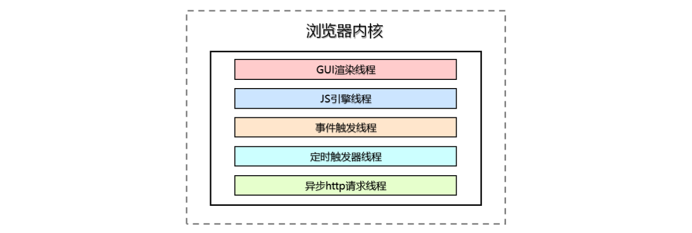
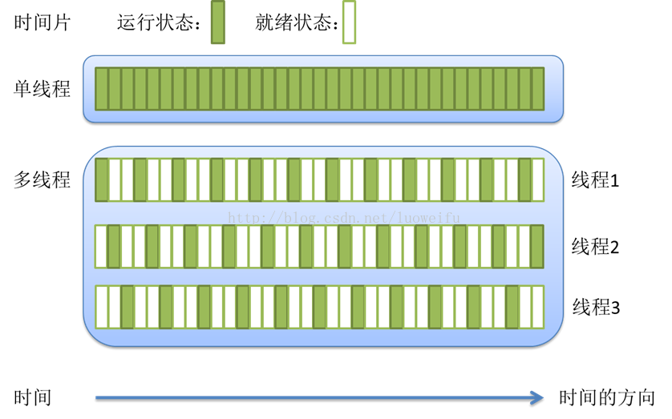

# JavaScript执行机制深度解析——从认识线程进程开始

## 线程和进程

> 概括：  
> **进程** 是计算机进行资源分配和调度的基本单位。  
> **线程** 是操作系统能够进行运算调度的最小单位。  
> 进程包括多个线程，一个进程可以有多个线程，每个独立运行着的程序称为一个进程，进程中最少有一个线程，简单的说进程就是操作系统的一个软件，线程就是进程中的一条执行路径

  

1、进程（process）

狭义定义：进程就是一段程序的执行过程。
广义定义：进程是一个具有一定独立功能的程序关于某个数据集合的一次运行活动。它是操作系统动态执行的基本单元，在传统的操作系统中，进程既是基本的分配单元，也是基本的执行单元。

简单的来讲进程的概念主要有两点：  
* 第一，进程是一个实体。每一个进程都有它自己的地址空间，一般情况下，包括文本区域（text region）、数据区域（data region）和堆栈（stack region）。文本区域存储处理器执行的代码；数据区域存储变量和进程执行期间使用的动态分配的内存；堆栈区域存储着活动过程调用的指令和本地变量。
* 第二，进程是一个“执行中的程序”。程序是一个没有生命的实体，只有处理器赋予程序生命时，它才能成为一个活动的实体，我们称其为进程。

进程状态：进程有三个**状态**，**就绪**、**运行**和**阻塞**。就绪状态其实就是获取了出cpu外的所有资源，只要处理器分配资源就可以马上执行。就绪状态有排队序列什么的，排队原则不再赘述。运行态就是获得了处理器分配的资源，程序开始执行。阻塞态，当程序条件不够时候，需要等待条件满足时候才能执行，如等待i/o操作时候，此刻的状态就叫阻塞态。

2、多线程的好处：
1）多线程提高执行效率
2）可以提高资源利用率
从宏观意义上讲多线程同一时刻执行多个线程，微观意义上来说cpu同一时刻只执行一个线程cpu时间片段

2、线程（thread）

通常在一个进程中可以包含若干个线程，当然一个进程中至少有一个线程，不然没有存在的意义。线程可以利用进程所拥有的资源，在引入线程的操作系统中，通常都是把进程作为分配资源的基本单位，而把线程作为独立运行和独立调度的基本单位，由于线程比进程更小，基本上不拥有系统资源，故对它的调度所付出的开销就会小得多，能更高效的提高系统多个程序间并发执行的程度。

3、多线程

在一个程序中，这些独立运行的程序片段叫作“线程”（Thread），利用它编程的概念就叫作“多线程处理”。多线程是为了同步完成多项任务，不是为了提高运行效率，而是为了提高资源使用效率来提高系统的效率。线程是在同一时间需要完成多项任务的时候实现的。

最简单的比喻多线程就像火车的每一节车厢，而进程则是火车。车厢离开火车是无法跑动的，同理火车也不可能只有一节车厢。多线程的出现就是为了提高效率。

二、说说区别

1、进程与线程的区别：

进程和线程的主要差别在于它们是不同的操作系统资源管理方式。进程有独立的地址空间，一个进程崩溃后，在保护模式下不会对其它进程产生影响，而线程只是一个进程中的不同执行路径。线程有自己的堆栈和局部变量，但线程之间没有单独的地址空间，一个线程死掉就等于整个进程死掉，所以多进程的程序要比多线程的程序健壮，但在进程切换时，耗费资源较大，效率要差一些。但对于一些要求同时进行并且又要共享某些变量的并发操作，只能用线程，不能用进程。

1. 简而言之,一个程序至少有一个进程,一个进程至少有一个线程.
2. 线程的划分尺度小于进程，使得多线程程序的并发性高。
3. 另外，进程在执行过程中拥有独立的内存单元，而多个线程共享内存，从而极大地提高了程序的运行效率。
4. 线程在执行过程中与进程还是有区别的。每个独立的线程有一个程序运行的入口、顺序执行序列和程序的出口。但是线程不能够独立执行，必须依存在应用程序中，由应用程序提供多个线程执行控制。
5. 从逻辑角度来看，多线程的意义在于一个应用程序中，有多个执行部分可以同时执行。但操作系统并没有将多个线程看做多个独立的应用，来实现进程的调度和管理以及资源分配。这就是进程和线程的重要区别。

  

### 关于JavaScript单线程这件事情

首先，JavaScript这一门单线程的语言（一段时间内只能做一件事）。那么为什么JavaScript设计之初是单线程语言。举个简单的例子，假定JavaScript同时有两个线程，一个线程在某个DOM节点上添加内容，另一个线程删除了这个节点，这时浏览器应该以哪个线程为准？ 所以，为了避免复杂性，从一诞生，JavaScript就是单线程，这已经成了这门语言的核心特征 。

  

单线程就意味着，所有任务需要排队，前一个任务结束，才会执行后一个任务。如果前一个任务耗时很长，后一个任务就不得不一直等着。

如果排队是因为计算量大，CPU忙不过来，倒也算了，但是很多时候CPU是闲着的，因为IO设备（输入输出设备）很慢（比如Ajax操作从网络读取数据），不得不等着结果出来，再往下执行。

为了解决等待异步任务执行结果过程中，资源闲置的问题，JavaScript语言的设计者意识到，这时主线程完全可以不管IO设备，挂起处于等待中的任务，先运行排在后面的任务。等到IO设备返回了结果，再回过头，把挂起的任务继续执行下去。

具体的做法就是让JS引擎执行JavaScript代码的主线程时分配一个stack，这就是**同步执行栈**，也叫做**调用栈（call stack）**，同时让JS引擎维护一个异步队列，用于维护异步事件，这就是**异步队列（event queue）**。