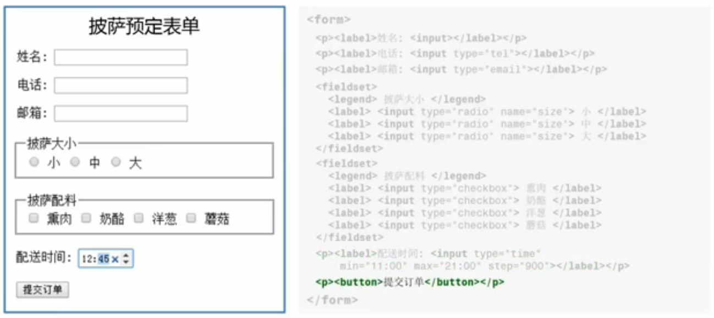

# 认识React组件基础篇——受控组件 & 非受控组件

## 认识表单

在介绍受控组件和非受控组件之前，先简单介绍一下HTML中的表单。表单是一类特殊的HTML标签，用于搜集不同类型的用户输入。

首先，`<form>` 元素定义 HTML 表单，表单元素指的是不同类型的 `input` 元素、复选框、单选按钮、提交按钮等等。



``` js
<form>
  <p><label>姓名：<input></label></p>
  <p><label>电话：<input type="tel"></label></p>
  <p><label>邮箱：<input type="email"></label></p>
  <fieldset>
    <legend> 披萨大小 </legend>
    <label><input type="radio" name="size"> 小 </label>
    <label><input type="radio" name="size"> 中 </label>
    <label><input type="radio" name="size"> 大 </label>
  </fieldset>
  <fieldset>
    <legend> 披萨配料 </legend>
    <label><input type="checkbox"> 熏肉 </input></label>
    <label><input type="checkbox"> 奶酪 </input></label>
    <label><input type="checkbox"> 洋葱 </input></label>
    <label><input type="checkbox"> 蘑菇 </input></label>
  </fieldset>
  <p><label>配送时间：<input type="time" min="11:00" max="2100" step="900"></label></p>
  <p><button>提交订单</button></p>
</form>
```

表单为页面的主要组成部分，其中包含许多的表单控件。用户通过控件提供数据并提交给服务器，服务器则做出相应的处理。而编写一个正常工作的表单需要三个部分：

构建表单
服务器处理（提供接受数据接口）
配置表单

以往我们利用表单的时候，构建表单，配置表单之后，然后将表单的数据的提交给服务器处理。如果在对表单

但是表单元素有其特殊之处，用户可以通过键盘输入与鼠标选择，改变界面的显示。界面的改变也意味着有一些数据被改动，比较明显的是input的value，textarea的innerHTML，radio/checkbox的checked，不太明显的是option的selected与selectedIndex，这两个是被动修改的。

还是回到React最本质的问题，React是一个单向数据流的视图层框架，我们希望数据和视图分离，我们能够完全掌握对数据的操作，从而通过改变数据去改变视图。那么form的问题又在哪里？表单元素相当特殊，通过上面示例我们可以发现，用户可以通过键盘输入与鼠标选择，改变界面的显示。界面的改变也意味着有一些数据被改动，比较明显的是input的value，textarea的innerHTML，radio/checkbox的checked，不太明显的是option和selected与selectedIndex，这两个是被动修改的。这些充分说明了表单是有自己的状态，并且能够自己维护的，但这样一样就和React的理念有所冲突，React是希望view只负责展示，data由React进行管理和维护。

由此，我们就可以引申出受控组件和非受控组件两个概念，让我们看看React是如何解决这个问题的。

## 受控组件

既然React和原生表单有数据控制权的冲突，那么让我们看看React是如何解决这个问题的。

``` js
import React, { Component } from 'react';

class App extends Component {
  constructor(props) {
    super(props);

    this.state = {
      inputValue: ''
    };

    this.handleInputChange = this.handleInputChange.bind(this);
  }

  handleInputChange(e) {
    this.setState({
      inputValue: e.target.value
    });
  }

  render() {
    const { inputValue } = this.state;

    return (
      <div>
        <input
          type='text'
          value={inputValue}
          onChange={this.handleInputChange}
        />
        <p>输入内容： {inputValue}</p>
      </div>
    );
  }
}
```

这就是受控组件！
当运行这段代码的时候，你会惊人发现这跟数据双向绑定是惊人的相似。值得注意的是，要牢记我们在React框架的js中写的html其实是JSX，官方文档也提醒了这点，我们可以像写html标签一样写JSX，但其实这并不是html。注意这一点我们就会发现，通过React强大的合成事件机制，React取到对表单状态的控制权，并且产生了类似数据双向绑定的效果。

然后我们总结一下React受控组件更新state的流程：

1. 可以通过在初始state中设置表单的默认值。
2. 每当表单的值发生变化时，调用onChange事件处理器。
3. 事件处理器通过合成事件对象e拿到改变后的状态，并更新应用到state。
4. setState触发视图的重新渲染，完成表单组件值的更新。

到这里我们可以看出，基于React的单向数据流，表单的数据来源于state或者props，然后通过onChange事件处理器将新的表单数据写回到state，完成数据双向绑定。

至此，受控组件中受控二字便解释的淋漓尽致。受控组件的特点也一览无余。
* 表单的数据来源于state或props。
* 通过合成事件处理器onChange更新状态。

## 非受控组件

React 自己控制表单的数据产生了受控组件，那是否有非受控组件，答案是有的。

``` js
class NameForm extends React.Component {
  constructor(props) {
    super(props);
    this.handleSubmit = this.handleSubmit.bind(this);
    this.input = React.createRef();
  }

  handleSubmit(event) {
    alert('A name was submitted: ' + this.input.current.value);
    event.preventDefault();
  }

  render() {
    return (
      <form onSubmit={this.handleSubmit}>
        <label>
          Name:
          <input type="text" ref={this.input} />
        </label>
        <input type="submit" value="Submit" />
      </form>
    );
  }
}
```

在React中判定一个组件是否为非受控组件的方法还是非常简单的，如果一个表单组件没有value props（单选按钮和复选框对应的是checked prop）时，那么它就是非受控组件。相应的，我们可以使用defaultValue 和 defaultChecked prop 来表示组件的默认状态。

在React中，非受控组件是一种反模式，它的值不受组件自身的state或props控制。通常需要通过为其添加ref prop来访问渲染后的底层dom元素。

## 受控组件和非受控组件对比

无状态组件(Stateless Component )和有状态组件(Stateful Component)，划分依据是根据组件内部是否维护state。无状态组件内部不使用state，只根据外部组件传入的props返回待渲染的React元素。有状态组件内部使用state，维护自身状态的变化，有状态组件根据外部组件传入的props和自身的state，共同决定最终返回的React 元素。

> 受控组件和非受控组件两者之间最大的区别是：非受控组件的状态并不会受应用状态的控制，应用中也多了局部组件状态，而受控组件的值来自于组件的state。

另外性能上的问题，由于受控组件依赖事件处理器onChange来更新状态，一定程度上会带来性能的损耗，但React仍然提倡使用受控组件，相比较性能上损耗，带来对于状态的管理，尤其是在大型复杂表单上收益是要远远大于损失的。

受控组件是必须提供事件处理器onChange，来同步 表单值和组件的状态，在这个必要条件下，我们可以通过一些技术手段避免声明大量事件处理函数，在一个函数中通过条件 判断来处理多个表单域是一种常规手段。

很容易知道，函数组件一定是无状态组件，类组件则既可以充当无状态组件，也可以充当有状态组件。但如上文所述，当一个组件不需要管理自身状态时，也就是无状态组件，应该优先设计为函数组件。

## 表单几个重要属性

主要分为 1、状态属性；2、事件属性 两大类

* 状态属性
  1. value：类型为text的input组件、textarea组件以及select组件都借助value prop来展示应用的状态。
  2. checked：类型为radio或checkbox的组件借助值为boolean类型的checked prop 来展示应用的状态 。
  3. selected：该属性可作用于select组件下面的option上，React并不建议使用这种方式表示状态，而推荐在select组件上使用value的方式。
* 事件属性
  1. onChange：上面提到的状态属性与事件属性存在一定关联——在状态属性发生变化时，会触发onChangee事件属性。受控组件中的change事件与HTML DOM中提供的额input事件更为了类似。同样，React支持DOM Level 3 定义的所有表单事件。

## 参考资料

* [表单操作 [caibaojian]][1]
* [创建我的第一个表单 [MDN]][2]
* [受控组件 [reactjs.org/docs]][3]
* [非受控组件 [reactjs.org/docs]][4]

[1]: http://caibaojian.com/fend_note/chapter3/12_form_manipulation.html
[2]: https://developer.mozilla.org/zh-CN/docs/Learn/HTML/Forms/Your_first_HTML_form
[3]: https://zh-hans.reactjs.org/docs/forms.html#controlled-components
[4]: https://zh-hans.reactjs.org/docs/uncontrolled-components.html