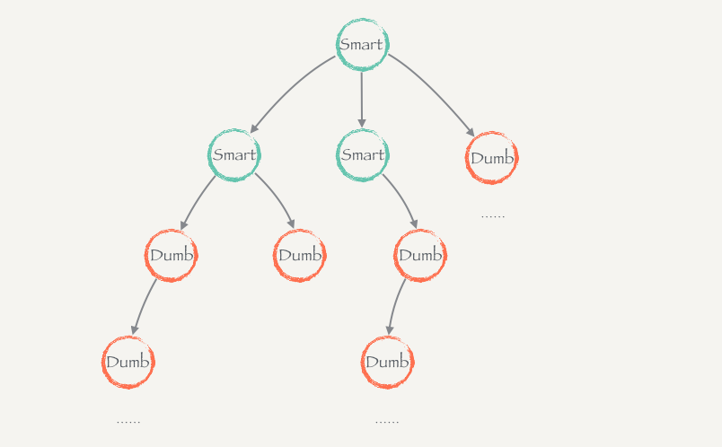

# React组件设计技巧——木偶组件和聪明组件

你要是把你的组件分成两大类。。你将会发现，这样的话你更容易思考你的组件该怎么写。。而你的组件写出来也更容易复用。我把这两大类称作 Smart和 Dumb，但是我也听说他们被称为Fat 和 Skinny, Stateful 和 Pure, Screens 和 Components等。虽然叫法不同，但核心思想都差不多

Dumb components:
-它必须能独立运作。。不能依赖依赖这个app的actions 或者 stores 部分

可以允许有this.props.children,这样的话有助于这个组件有修改弹性

接受数据和数据的改变只能通过props來处理,不必也不能用state。

组件的外观能用一个css來维护(这样才更容易重用，类似支付宝的ant)

很少用到state,(一般呈现动画的时候可能会用到。。比如控制下拉框的展开或者收起)

也许会用到其他的dumb components

比如说: Page, Sidebar, Story, UserInfo, List,像这些都是dumb components.

smart components:
一定包含至少一个Smart 或者 Dumb的元件，（这肯定啊。。不然他干的啥）

负责把从flux(or redux等)接收到的state传给dumb component

负责call action,并把它的callback传給dumb component

它应该只有结构没有外观（这样的话。。改个样式只需要改dumb 组件 就好了。。他写着。。他写那里 不然很累啊）

比如说: UserPage, FollowersSidebar, StoryContainer,
FollowedUserList.

这样做的好处
有助理你分离关注点，这样的话更有助于理解你的app的业务逻辑 和 它的ui

更有助于复用你的dumb组件，你可以将你的dumb组件复用于别的state下，而且这两个state还完全不同

本质上dumb 组件 其实 就是你的app的调色版。。你可以将它们放到一个页面上。。然后让设计师除了app的业务逻辑，样式随便怎么改，

## 参考资料

* [Smart 组件 vs Dumb 组件][1]
* [组件化开发中的智能组件与木偶组件][2]
* [React（四）：Smart组件与Dumb组件][3]
* [［译］Smart and Dumb Components][4]

[1]: http://huziketang.mangojuice.top/books/react/lesson43
[2]: https://juejin.im/entry/579ec0efc4c971005ade40ad
[3]: https://blog.csdn.net/u012131835/article/details/83823977
[4]: https://segmentfault.com/a/1190000004111786

