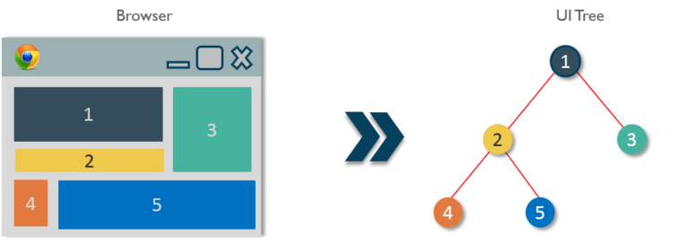

# React组件设计技巧——木偶组件和聪明组件

回到最初的话题： “组件化”。在我刚入行的时候，还不知道前端组件化是什么东西，那时候怎么写前端？html和css先写好，然后就是jQuery一把梭子“嘟嘟嘟”的打完收工。那画面也是美得不敢想象，一个js文件几千行代码，业务逻辑又长又臭，软件设计所谓的解耦复用连个鬼影都看不到，顶多把复杂的业务逻辑抽离以下，优化成单独的js文件。

然后就是前端组件化的时代带来了，从React到VUE，虽然还有什么虚拟dom、MVVM、diff算法等等花里胡哨的东西，但是组件化也是实打实为前端开发带来的春天，前端开发变得有章法可依，经典的软件设计理念也可以在前端开发中畅快淋漓的施展。

话题转回来，前端组件化到底给我们带来了什么？

百度百科：组件化是一种高效的处理复杂应用系统，更好的明确功能模块作用的方式。

通俗理解：在几年前端开发，应用系统中的功能模块之间是相互依赖、高度耦合。例如：修改A模块，就先找到跟A模块相关联的其他模块，注意修改A模块会对其他模块造成的影响；组件化不是一门新技术，它是一种思想。旨于构建纯粹的模块（称为组件化，进行组件化的模块为组件），模块单一功能原则，以此降低模块之间的耦合和依赖。

总结：组件化主要为了拆分复杂应用，降低模块之间的耦合度，明确组件之间的边界，有利于代码维护。提高组件复用（代码复用）；

1. 可组合（Composeable）：一个组件易于和其它组件一起使用，或者嵌套在另一个组件内部。如果一个组件内部创建了另一个组件，那么说父组件拥有（own）它创建的子组件，通过这个特性，一个复杂的UI可以拆分成多个简单的UI组件；
2. 可重用（Reusable）：每个组件都是具有独立功能的，它可以被使用在多个UI场景；
3. 可维护（Maintainable）：每个小的组件仅仅包含自身的逻辑，更容易被理解和维护；
4. 可测试（Testable）：因为每个组件都是独立的，那么对于各个组件分别测试显然要比对于整个UI进行测试容易的多。

但遗憾的是，真正好的框架也只有在真正努力好好使用它的开发手中，才能发挥出最大的价值。如何发挥出最大的价值，React框架已经把开发过程约束在组件化的体系之中，如何设计出更好的组件就是对于React最大使用价值的发挥。

再回到我们今天的话题：聪明组件和木偶组件。

虽然组件化时代已经到来，但是仍然阻止不了散发怪味道的代码，软件开发没有银弹，React、VUE也不可能是银弹。一个页面就是一个大组件的做法，在世间还是屡见不鲜的。为了写出更优秀的代码，我们不妨把那些体积庞大的组件合理拆分，然后思考以下这个拆分的过程。

为什么要把组件拆分成聪明组件和木偶组件？一个既定的事实是，前端的交互实质是对数据的操作，只不过这是一个可视化的过程，复杂的业务逻辑就避免不了使用 `redux` `react-redux`等工具对数据进行管理，也避免使用axios发送请求，更避免不了要处理复杂的数据结构，或是按照业务逻辑处理数据。一方面我们需要组件完成这些工作（比如说：聪明组件）。另一方面，有些可能只需要展示或者完成一些简单的交互操作的部分，我们不妨抽离成单独的组件，使其具有更好的可测试性、可组合性、复用性（比如说：木偶组件）。

到这里，我们把组件分成两大类，经过这样的分类，我们就更容易思考组件该怎么写。我把这两大类称作 Smart和 Dumb，但是我也听说他们被称为Fat 和 Skinny, Stateful 和 Pure, Screens 和 Components等。虽然叫法不同，但核心思想都差不多。

**Dumb components:**

⚠️它必须能独立运作，不能依赖依赖这个app的actions 或者 stores 部分
* 可以允许有this.props.children,这样的话有助于这个组件有修改弹性
* 接受数据和数据的改变只能通过props來处理,不必也不能用state。
* 组件的外观能用一个css來维护(这样才更容易重用，类似支付宝的ant)
* 很少用到state,(一般呈现动画的时候可能会用到，比如控制下拉框的展开或者收起)
* 也许会用到其他的dumb components
* 比如说: Page, Sidebar, Story, UserInfo, List,像这些都是dumb components.

**smart components:**

* 一定包含至少一个Smart 或者 Dumb的元件，（木偶组件肯定是依附聪明组件生存的）
* 负责把从flux(or redux、Mobx等)接收到的state传给dumb component
* 负责call action,并把它的callback传給dumb component
* 它应该只有结构没有外观（改个样式只需要改dumb组件就好了，否则维护多个样式表很麻烦。）
* 比如说: UserPage, FollowersSidebar, StoryContainer,FollowedUserList.

这样做的好处
有助理你分离关注点，这样的话更有助于理解你的app的业务逻辑 和 它的ui

更有助于复用你的dumb组件，你可以将你的dumb组件复用于别的state下，而且这两个state还完全不同

本质上dumb 组件 其实 就是你的app的调色版。。你可以将它们放到一个页面上。。然后让设计师除了app的业务逻辑，样式随便怎么改，

## 参考资料

* [Smart 组件 vs Dumb 组件][1]
* [组件化开发中的智能组件与木偶组件][2]
* [React（四）：Smart组件与Dumb组件][3]
* [［译］Smart and Dumb Components][4]
* [React Components – Props and States in ReactJS with Examples][5]

[1]: http://huziketang.mangojuice.top/books/react/lesson43
[2]: https://juejin.im/entry/579ec0efc4c971005ade40ad
[3]: https://blog.csdn.net/u012131835/article/details/83823977
[4]: https://segmentfault.com/a/1190000004111786
[5]: https://www.edureka.co/blog/react-components/
